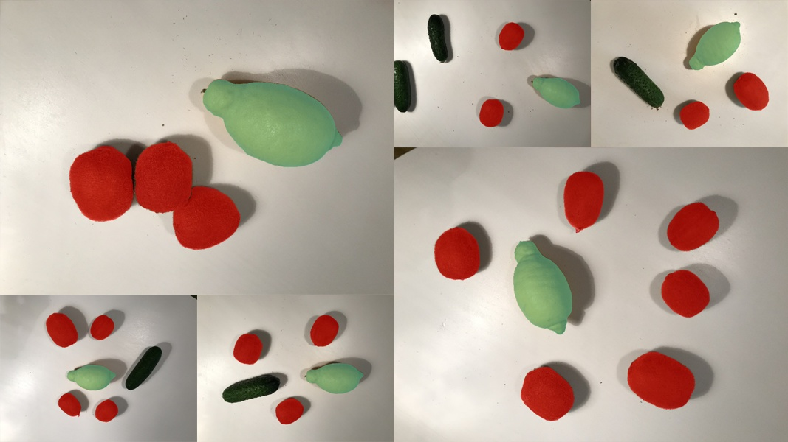

# lemons_annotated
 `lemons_annotated` is an example project with annotated lemons and kiwifruits, with 6 images in it. Direct download is available 
[here](x).

`lemons_annotated` is a small demo dataset, perfect for flash testing of segmentation and detection models. It can be used to quickly train and test neural networks on a small amount of images.

Stats

   

License type: 

How to import:

