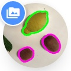
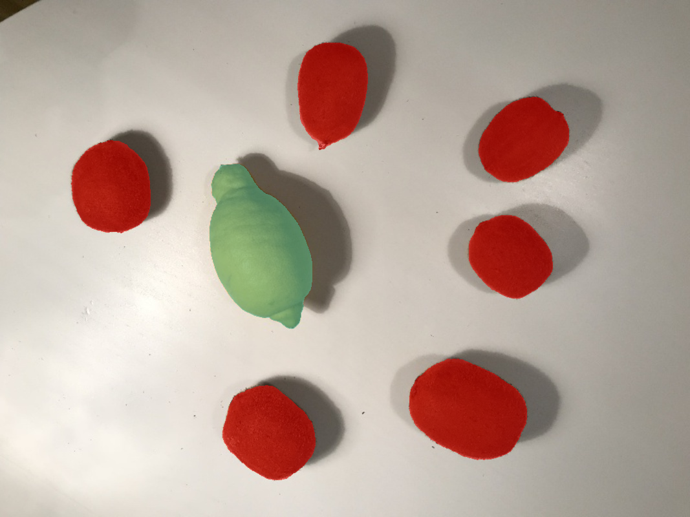
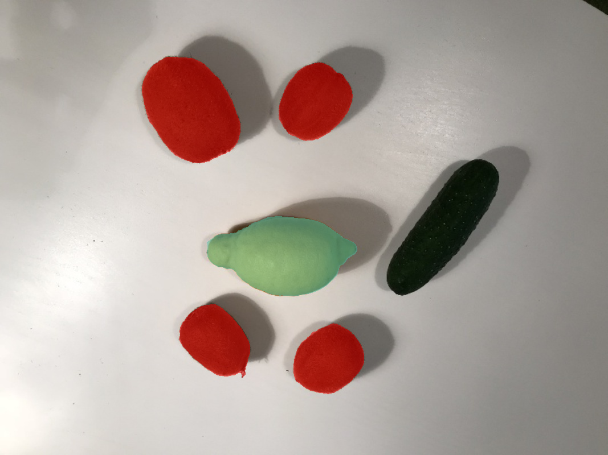

# Lemons Annotated   

  <a href="#overview">Overview</a> |
  <a href="#key-features">Key Features</a> |
  <a href="#how-to-use">How To Use</a> |
  <a href="#docs">Docs</a> |
  <a href="#resources">Resources</a> |
  <a href="#community">Community</a> |
  <a href="#faq">FAQ</a> |
  <a href="#licence">Licence</a>

# Overview 

 `lemons_annotated` is an example project with annotated lemons and kiwifruits, with 6 images in it. Direct download is available 
[here](x).

## Dataset Description 
`lemons_annotated` is a small demo dataset, perfect for flash testing of segmentation and detection models. It can be used to quickly train and test neural networks on a small amount of images.

## Dataset Statistics
...

## Example Images

   

## License Type
...

## How To Import
...
